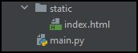

+++
author = "Torben"
title = "Webserver as a function - Part 1"
date = "2021-10-10"
description = "Host a static web page with Flask"
categories = ["Cookbook",]
tags = ["Python", "Flask", "Static Web Page"]
+++

# TL;DR
Flask already serves static files by default.
Complying with the default structure makes the setup very easy.

# Motivation 
* Very fast setup of a web server locally
* One deployment artefact can contain static and dynamic parts

# Prerequisites
1. Installed python
2. Flask library is available

# Approach
## Default setup
Flask already serves static files by default. 
This Hello World example already serves static files on [http://127.0.0.1:5000/static/](http://127.0.0.1:5000/static/).


from flask import Flask

app = Flask(__name__)

if __name__ == '__main__':
  app.run()


Important are the parameters *static_folder* and *static_url_path*.

*static_folder* is the path to the folder containing the static files. 
The path can be relative to the application *root_path* or absolute.
The constructor sets *static_folder* by default to 'static'.

*static_url_path* is the path on which the static content is hosted defaulting to the value of *static_folder*.



app = Flask(__name__, static_folder='static', static_url_path=None)



## Host a simple website
To illustrate we create a folder called 'static' and add an example html file.
The directory structure should look like this:



<html>
  <body>
    <h1>Hello from the static folder!</h1>
  </body>
</html>



Running the application and opening [http://127.0.0.1:5000/static/index.html](http://127.0.0.1:5000/static/index.html) we can see the example website.

## Change the root path

Personally, I prefer to host my website directly on the root path. To achieve this, *static_url_path* is set to ''.



app = Flask(__name__, static_url_path='')



Restart the application, and we can see the improved paths at [http://127.0.0.1:5000/index.html](http://127.0.0.1:5000/index.html).

# Further Reading
* Code can be found in [this GitHub project](https://github.com/torbenmoeller/pluvial-waaf).
* Often it is much easier to host the website in a storage bucket. 
  [GCP](https://cloud.google.com/storage/docs/hosting-static-website), 
  [AWS](https://docs.aws.amazon.com/AmazonS3/latest/userguide/WebsiteHosting.html) and
  [Azure](https://docs.microsoft.com/en-us/azure/storage/blobs/storage-blob-static-website) provide guidelines for this.
* Also containerized solutions with NGINX or Apache HTTP Server are much more common.
* One advantage of this approach is the creation of one deployment artefact that can include frontend and backend. 
* The costs can be quite high for a website with high traffic. Please check your cloud billing estimations beforehand.
* To reduce costs you can use CDNs and other caching mechanisms.  
